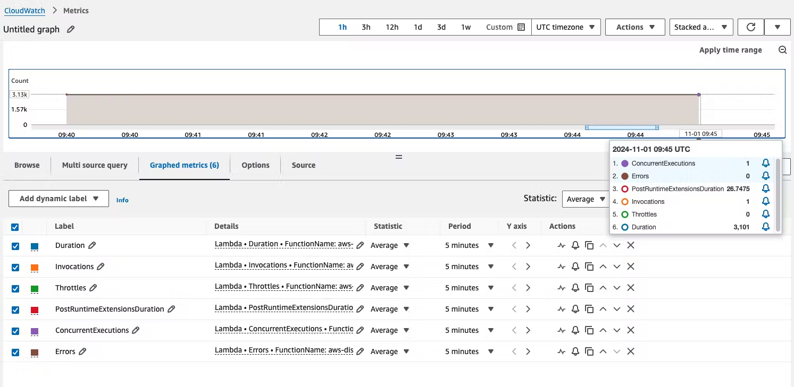

# AWS Lambda native integration with CloudWatch and X-Ray

AWS Lambda example for the native integration with CloudWatch and X-Ray.

This code example is using [SST Ion](https://sst.dev/) to deploy a single function in AWS Lambda to showcase the native integration with CloudWatch (for logs and metrics) and X-Ray (for tracing).

## Invocation Metrics

When your AWS Lambda function finishes processing an event, Lambda sends metrics about the invocation to Amazon CloudWatch. There is no charge for these metrics.

https://docs.aws.amazon.com/lambda/latest/dg/monitoring-metrics.html

## X-Ray Daemon and Tracing

When you enable X-Ray Active Tracing, AWS Lambda service will inject X-Ray Daemon configuration and sends traces to X-Ray automatically.

You can see the trace events in X-Ray dashboard:

X-Ray SDK will load the configuration injected by the AWS Lambda service and automatically send invocation and custom tracing to X-Ray service:

