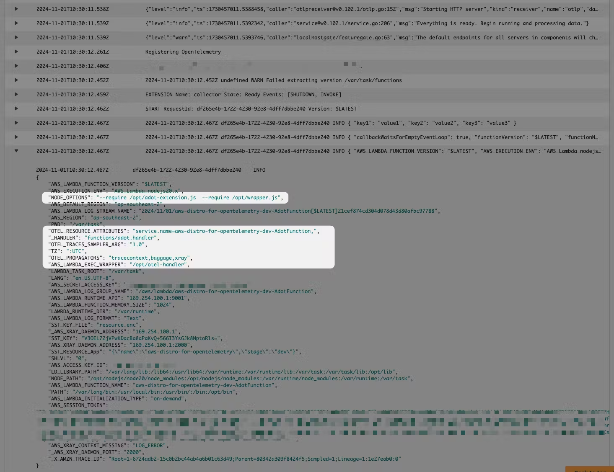
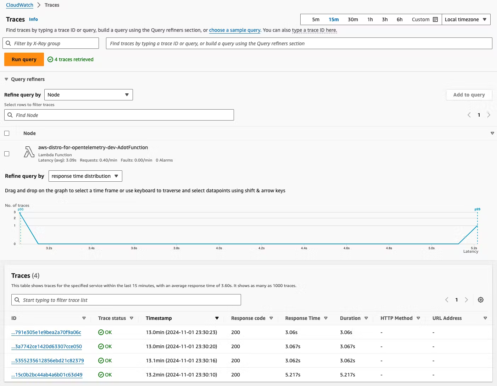
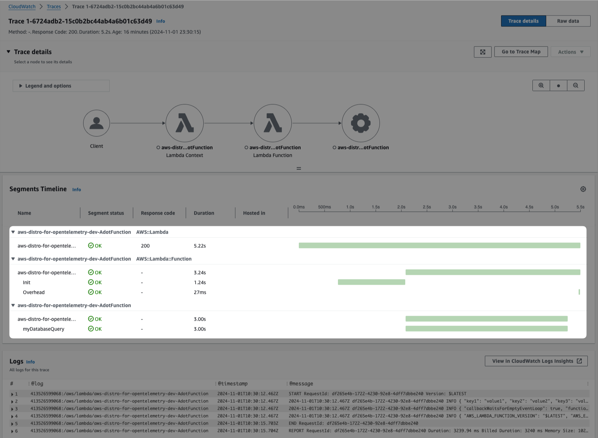

# AWS Lambda with AWS Distro for OpenTelemetry

This code example is using [SST Ion](https://sst.dev/) to deploy a single function in AWS Lambda to showcase the OpenTelemetry integration with [AWS Distro for OpenTelemetry](https://aws-otel.github.io/docs/introduction).

## Invocation Metrics

When your AWS Lambda function finishes processing an event, Lambda sends metrics about the invocation to Amazon CloudWatch. There is no charge for these metrics.

https://docs.aws.amazon.com/lambda/latest/dg/monitoring-metrics.html

## OpenTelemetry Collector

Using the AWS Distro for OpenTelemetry Lambda layer, the extension will inject production-ready configuration for you:

You can see the OTEL trace events in X-Ray dashboard:

We can see the timeline of our OTEL context within our application invocation in X-Ray dashboard:

